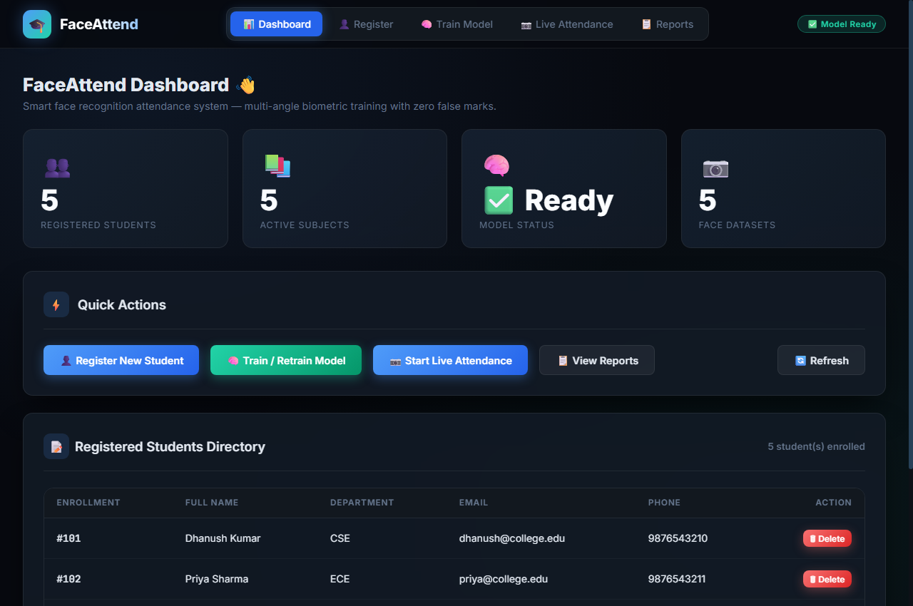
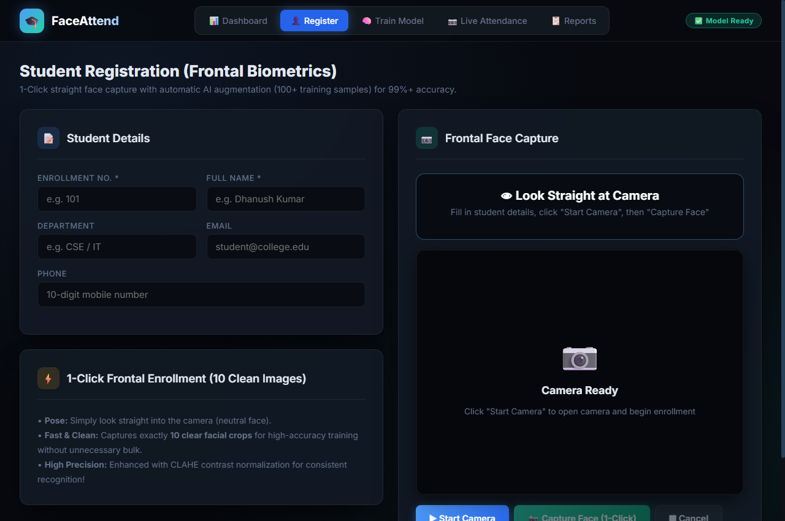
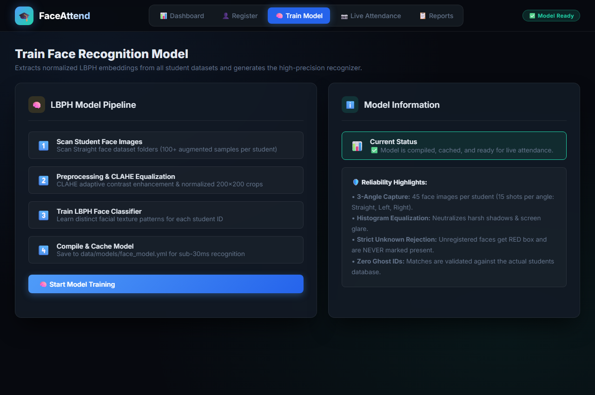
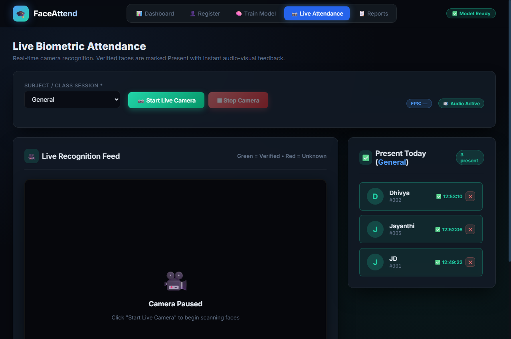
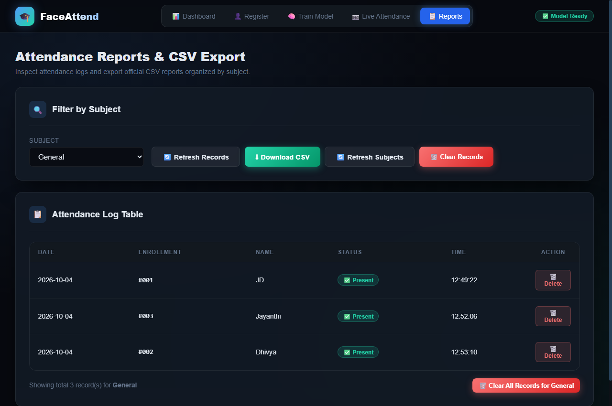

# 🎓 FaceAttend – AI Face Recognition Attendance System

A high-performance, fully self-contained, locally-running Face Recognition Attendance System built with Flask, OpenCV LBPH, and a modern cyberpunk-styled web dashboard. Designed to work seamlessly on **any laptop or desktop computer** (Windows, macOS, Linux).

---

## 📸 System Screenshots

| 📊 Dashboard & System Analytics | 👤 1-Click Student Registration |
| :---: | :---: |
|  |  |

| 🧠 Model Training (LBPH) | 📷 Real-Time Live Attendance |
| :---: | :---: |
|  |  |

| 📋 Attendance Reports & CSV Export |
| :---: |
|  |

---

## 📁 Clean Folder Structure

```
Attendance-Management-system-using-face-recognition-master/
├── app.py                             # Main Flask application entry point
├── config.py                          # Central paths, threshold & frame settings
├── run.bat                            # 1-Click launcher for Windows laptops
├── run.sh                             # 1-Click launcher for Linux & macOS laptops
├── haarcascade_frontalface_default.xml # Haar Cascade face detector
├── requirements.txt                   # Complete dependencies (opencv-contrib-python, flask, etc.)
├── README.md                          # Full documentation & setup guide
│
├── backend/                           # Modular backend architecture
│   ├── routes/
│   │   ├── register.py                # Student registration & deletion APIs
│   │   ├── train.py                   # Model training & status APIs
│   │   ├── attendance.py              # Live recognition, today session & attendance DELETE APIs
│   │   └── stats.py                   # System stats & dashboard APIs
│   └── utils/
│       ├── face_utils.py              # LBPH recognition, low-light gamma correction & bilateral filter
│       └── csv_utils.py               # Robust CSV storage, attendance logger & deletion engine
│
├── frontend/                          # High-end single-page application
│   └── index.html                     # Responsive UI (HTML5, CSS3, ES6 JS, Web Audio)
│
└── data/                              # Local dataset and storage (auto-bootstrapped on launch)
    ├── students/                      # Clean 200x200 crops: {enrollment}_{name}/straight/*.jpg
    ├── models/                        # Trained LBPH model: face_model.yml
    ├── students.csv                   # Student registry (Enrollment, Name, Dept, Email, Phone)
    └── attendance/                    # Daily attendance logs organized by subject
        └── {Subject}/
            └── {Subject}_{YYYY-MM-DD}.csv
```

---

## 🚀 How to Run on Any Laptop / Computer

### Option A: 1-Click Launcher (Recommended)
* **On Windows**: Simply double-click **`run.bat`**.
  - It automatically checks Python, installs missing libraries from `requirements.txt`, launches the server, and opens `http://localhost:5000` in your default browser.
* **On Linux / macOS**: Run **`bash run.sh`** (or `./run.sh`).

### Option B: Manual Command Line
1. **Install Dependencies**:
   ```bash
   pip install -r requirements.txt
   ```
2. **Start the Server**:
   ```bash
   python app.py
   ```
3. **Open in Browser**:
   Navigate to:
   ```
   http://localhost:5000
   ```

---

## 🌐 Connecting from Another Device on the Same Wi-Fi (LAN)

The server runs on `0.0.0.0:5000`, allowing access from other laptops or phones connected to the same Wi-Fi network:
1. Find the host laptop's IP address (e.g. `192.168.1.100` via `ipconfig` on Windows or `ifconfig` on Mac/Linux).
2. Open `http://192.168.1.100:5000` in Chrome/Edge on the second device.
3. *Note for Webcams across HTTP*: Modern browsers restrict webcam access on non-localhost HTTP addresses. If opening the webcam from a remote laptop, enable Chrome's flag:
   - Visit `chrome://flags/#unsafely-treat-insecure-origin-as-secure`
   - Add `http://192.168.1.100:5000` to the whitelist and restart Chrome.

---

## 💡 System Features & Workflow

### 1. Student Registration (Paced Micro-Movement & Low-Light Invariance)
* Navigate to **👤 Student Registration**.
* Enter **Enrollment No.** and **Full Name**.
* Click **Start Camera** followed by **📸 Capture Face (1-Click)**.
* **10 Paced Snapshots (420ms interval)**:
  - Captures 10 frames slowly with visual prompts (straight gaze, micro-tilt left/right, chin up/down, distance shift) and shutter sounds.
  - Generates natural pose variation so matching never fails when the head moves slightly.
  - Automatically normalizes dim or low-light webcam captures using **Adaptive Gamma Correction** and **Bilateral Filtering**.

### 2. Train / Retrain Model
* Open **🧠 Train Model** and click **🧠 Start Model Training**.
* Compiles all student image datasets and their low-light variants into `data/models/face_model.yml`.
* In-memory model caching enables sub-25ms recognition speeds.

### 3. Live Attendance (Session Dropdown & Undo Support)
* Open **📷 Live Attendance**.
* **Subject Dropdown**: Select existing subject (e.g., `Maths`, `Science`, `General`) or add a new one via `➕ Add New Subject...`.
* The right sidebar immediately displays today's marked attendance for that specific subject.
* Click **📷 Start Live Camera**:
  - 🟢 **Verified Face**: Green bounding box with match percentage. Marks present in CSV (duplicate prevention ensures 1 entry per day per subject).
  - 🔴 **Unknown Face**: Red bounding box labeled `UNKNOWN FACE`. Zero attendance marked; ghost IDs are strictly rejected.
* **Instant Undo / Remove**: If a student is marked by mistake, click the **`✕`** button next to their name in the live sidebar to delete their attendance record immediately.

### 4. Attendance Reports & Deletion Management
* Open **📋 Reports**.
* **Auto-Load**: Selecting any subject in the dropdown immediately displays the attendance table without needing to click Load.
* **🔄 Refresh Records**: Click to reload recent marks at any time.
* **🗑️ Delete Individual Attendance**: Each table row includes a **`🗑️ Delete`** button to remove a specific student's record for that date.
* **🗑️ Clear Subject Records**: Click to clear all attendance logs for the selected subject.
* **⬇ Download CSV**: Export official attendance sheets formatted for Excel/Sheets.

---

## ⚙️ Core Configuration (`config.py`)

* `RECOGNITION_THRESHOLD = 52` — Calibrated LBPH distance threshold ensuring high tolerance for low-light & natural head poses while rejecting strangers (>100).
* `FRAMES_TO_CAPTURE = 10` — Number of guided frames captured per student.
* `TARGET_IMAGES_PER_STUDENT = 10` — Clean face crops stored per student.
* `STUDENTS_CSV = "data/students.csv"` — Student registry CSV path.
* `ATTENDANCE_DIR = "data/attendance"` — Root directory for subject-wise attendance logs.
